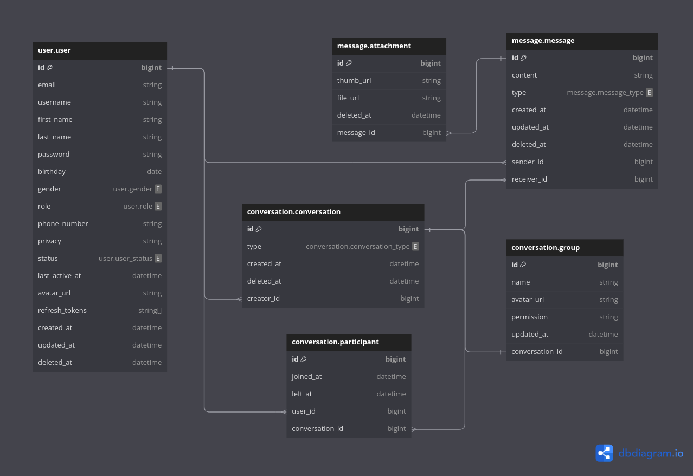

# Chat app database

This is database for chat app. It is created using PostgreSQL.

## Database schema



## Pre-requisites

- Docker
- PostgreSQL 13.2 image
- zsh and nvm plugin

## How to run

1. Clone the repository

```bash
git clone git@github.com:dungtl2003/chat-app-database.git
```

2. Download dependencies

```bash
npm install
```

3. Run the database

```bash
make up
```

4. Update schema

```bash
make generate_schema
```

5. Access the database

```bash
make access_db
```

6. Tear down the database

```bash
make down
```

7. Clean up the database

```bash
make clean
```
